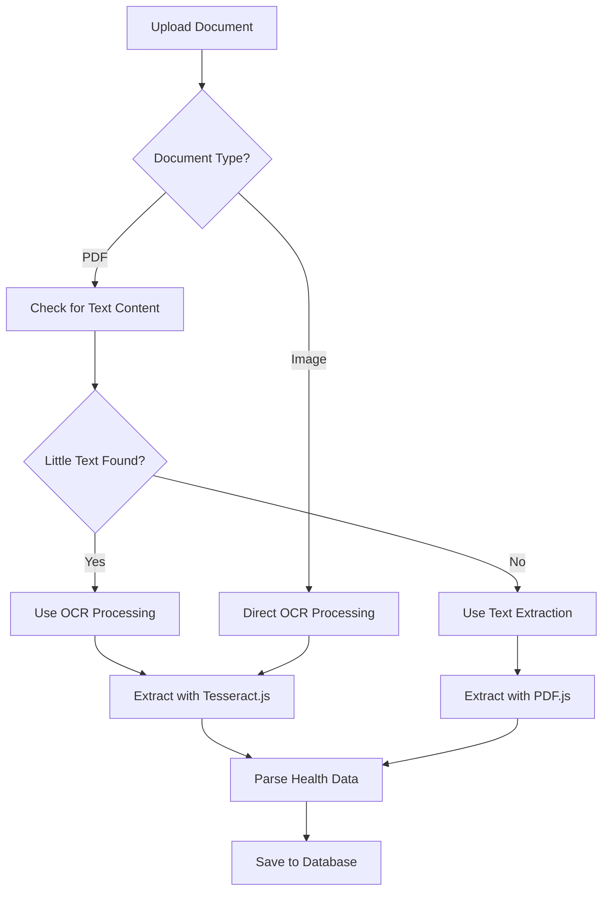

# Vision-Based Health Document Processing

## Overview
The health tracker now includes advanced vision processing capabilities using Tesseract.js OCR (Optical Character Recognition) to handle handwritten health documents, forms, and notes.

## New Capabilities

### 🔍 **OCR Processing**
- **Handwritten Documents**: Processes handwritten PDFs and images
- **Mixed Content**: Handles documents with both typed and handwritten text
- **Image Files**: Direct OCR processing of JPG, PNG images
- **Smart Detection**: Automatically detects if OCR is needed

### 📄 **Supported Document Types**
- **Typed PDFs**: Standard text extraction (fast)
- **Handwritten PDFs**: OCR processing for handwritten content
- **Scanned Documents**: Full OCR processing for scanned images
- **Mixed Documents**: Combines text extraction and OCR as needed
- **Image Files**: Direct OCR processing of health document photos

## Technical Implementation

### Dependencies Added
```bash
npm install tesseract.js
```

### Key Components

#### 1. **VisionPDFProcessor** (`src/lib/vision-pdf-processor.ts`)
- **Smart Detection**: Automatically detects handwritten content
- **Dual Processing**: Uses text extraction for typed content, OCR for handwritten
- **Enhanced Parsing**: Improved pattern recognition for handwritten text
- **Progress Tracking**: Real-time OCR progress feedback

#### 2. **Updated DocumentUpload** (`src/components/upload/DocumentUpload.tsx`)
- **Intelligent Processing**: Automatically chooses the right extraction method
- **Progress Feedback**: Shows different messages for OCR vs text extraction
- **Enhanced UI**: Displays OCR capabilities and processing status

### Processing Flow



### OCR Features

#### **Language Support**
- **English**: Primary language support
- **Medical Terms**: Optimized for health-related vocabulary
- **Numbers**: Enhanced recognition of medical values and units

#### **Processing Options**
- **Automatic Detection**: Determines if OCR is needed
- **Manual Override**: Can force OCR processing if needed
- **Progress Tracking**: Real-time feedback during OCR processing
- **Error Handling**: Graceful fallback if OCR fails

### Enhanced Pattern Recognition

#### **Handwritten Text Patterns**
- **Flexible Spacing**: Handles irregular spacing in handwritten text
- **Number Recognition**: Better recognition of handwritten numbers
- **Unit Detection**: Identifies medical units in handwritten format
- **Parameter Matching**: Enhanced matching for health parameters

#### **Health Parameter Detection**
```javascript
// Enhanced patterns for handwritten text
const patterns = [
  /([a-zA-Z\s]+):\s*([\d\.]+)\s*([a-zA-Z\/%]+)/i,
  /([a-zA-Z\s]+)\s+([\d\.]+)\s*([a-zA-Z\/%]+)/i,
  /([a-zA-Z\s]+)\s*=\s*([\d\.]+)\s*([a-zA-Z\/%]+)/i,
  // More flexible patterns for handwritten text
  /([a-zA-Z\s]{3,})\s*([\d\.]+)\s*([a-zA-Z\/%]+)/i,
  /([a-zA-Z\s]+)\s*([\d\.]+)\s*([a-zA-Z\/%]+)/i
]
```

## Benefits

### 🚀 **Performance**
- **Smart Processing**: Only uses OCR when needed
- **Fast Text Extraction**: Standard PDFs process quickly
- **Efficient OCR**: Optimized for health documents

### 🔒 **Privacy**
- **Client-Side Only**: All processing happens in the browser
- **No External APIs**: No data sent to external services
- **Local Processing**: Documents never leave the user's device

### 📱 **User Experience**
- **Automatic Detection**: No user input needed
- **Progress Feedback**: Clear status updates
- **Error Handling**: Graceful fallbacks and error messages

## Usage Examples

### **Handwritten Lab Results**
```
User uploads: Handwritten blood test results
Processing: OCR detects handwritten text
Result: Extracts hemoglobin, glucose, cholesterol values
```

### **Mixed Document**
```
User uploads: PDF with typed headers and handwritten values
Processing: Text extraction for headers, OCR for values
Result: Complete health data extraction
```

### **Scanned Document**
```
User uploads: Scanned image of health form
Processing: Full OCR processing
Result: Extracts all handwritten health data
```

## Performance Considerations

### **OCR Processing Time**
- **Small Images**: 2-5 seconds
- **Large PDFs**: 10-30 seconds
- **Complex Documents**: Up to 1 minute

### **Browser Requirements**
- **Memory**: 100-200MB for OCR processing
- **CPU**: Moderate usage during OCR
- **Storage**: Temporary files cleaned automatically

## Future Enhancements

### **Advanced OCR Features**
- **Multi-language Support**: Spanish, French, etc.
- **Handwriting Styles**: Better recognition of different handwriting
- **Table Recognition**: Enhanced table and form processing
- **Signature Detection**: Identify and skip signature areas

### **AI Integration**
- **Smart Preprocessing**: Image enhancement before OCR
- **Context Understanding**: Better medical term recognition
- **Confidence Scoring**: OCR confidence levels for results

## Troubleshooting

### **Common Issues**
1. **OCR Fails**: Falls back to text extraction
2. **Poor Recognition**: Try higher resolution images
3. **Slow Processing**: Large files take longer
4. **Memory Issues**: Close other browser tabs

### **Best Practices**
- **Image Quality**: Use clear, high-contrast images
- **File Size**: Keep under 10MB for best performance
- **Format**: PDFs work better than images for mixed content
- **Handwriting**: Clear, legible handwriting works best

## Technical Details

### **Tesseract.js Configuration**
```javascript
const { data: { text } } = await Tesseract.recognize(
  imageData,
  'eng',
  {
    logger: m => console.log('OCR Progress:', m)
  }
)
```

### **PDF to Canvas Conversion**
```javascript
const canvas = document.createElement('canvas')
const context = canvas.getContext('2d')
const viewport = page.getViewport({ scale: 2.0 })
// ... render PDF page to canvas
```

The vision processing system now makes your health tracker capable of handling any type of health document, from typed lab results to handwritten notes and forms!

